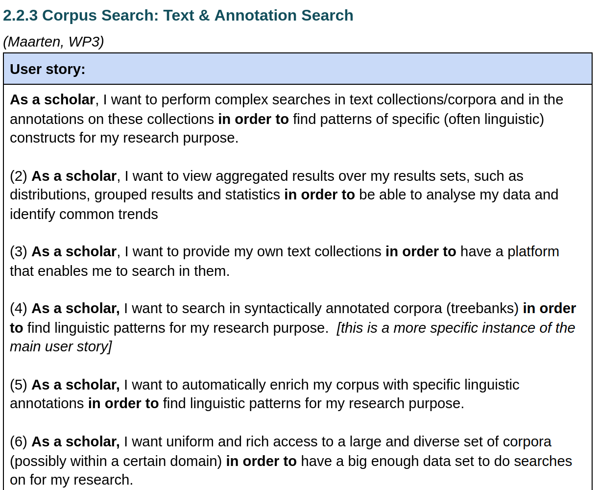
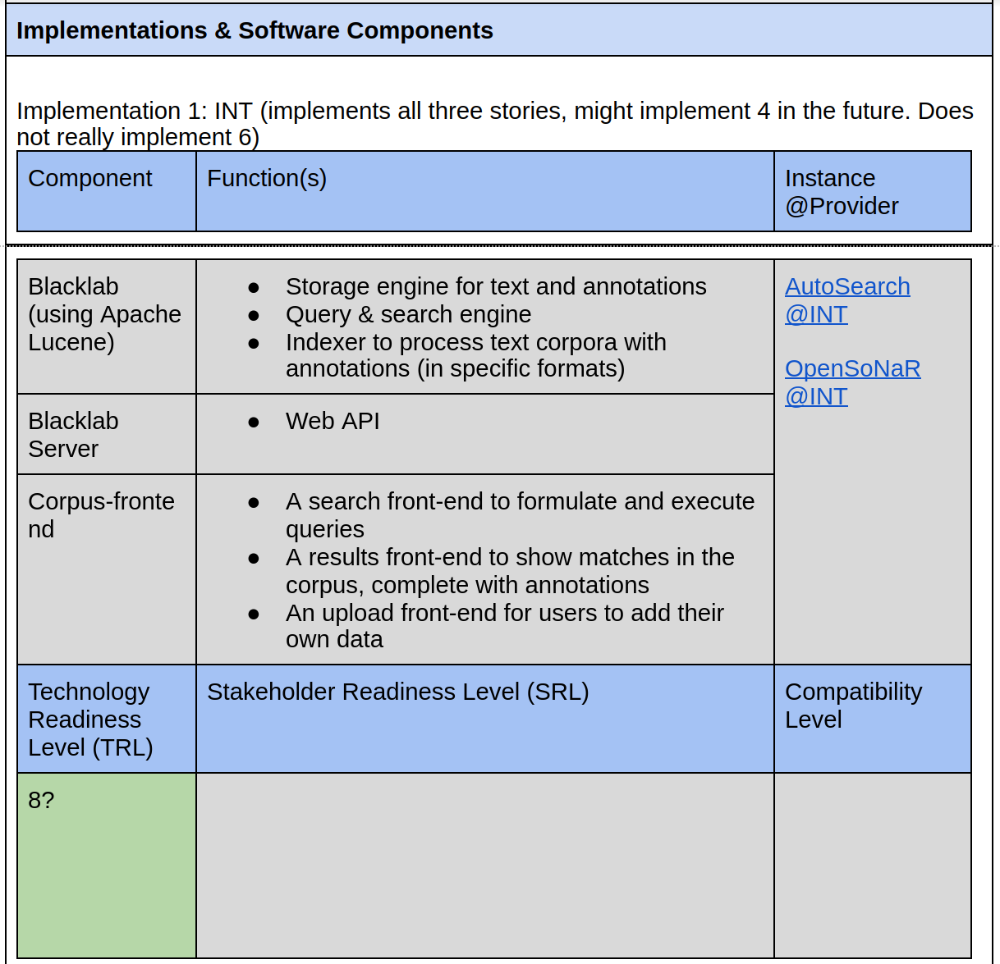
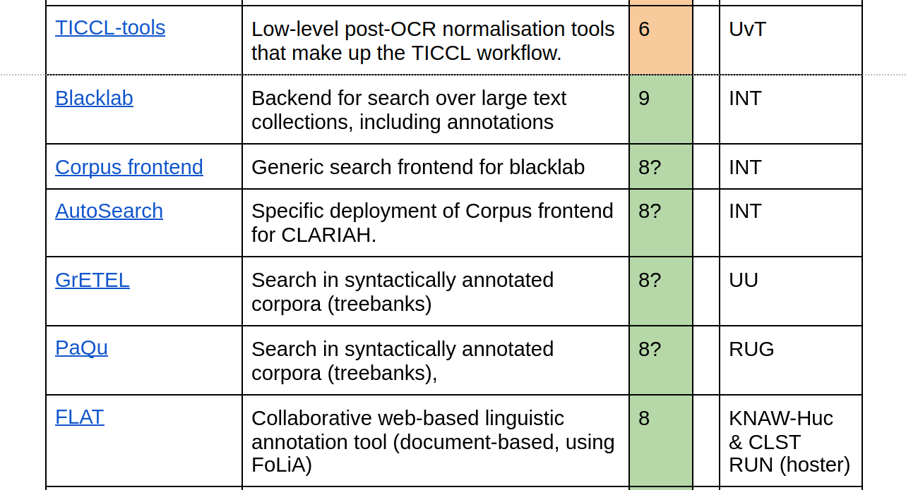

# CLARIAH Heden & Toekomst: Shared Development Roadmap

## Huidige Situatie

**Doel:** We bouwen een **shared common infrastructure** (for the humanities)

Maar...

* In hoeverre kunnen we daar nu van spreken?
* **Realiteit:** meerdere onafhankelijke infrastructuren
* Wat betekent het om deel uit te maken van de CLARIAH infrastructuur / CLaaS ?
    * Welke eisen stelt CLARIAH?

## Huidige situatie (2)

* Gebrek aan interoperabiliteit, ook *binnen* WP3
* Gebrek aan duidelijk vastgelegde afspraken over interoperabiliteit
  (specificaties/requirements).
* Te weinig samenwerking tussen WP's
* Moeilijk overzicht te krijgen, veel legacy binnen WP3 en vanuit CLARIN
* Dubbel/conflicterend werk (ook binnen WP3)

## Gewenste situatie

* **Harmonisatie:** Meer interoperabiliteit tussen tools en services
    * Meer samenwerking, minder dubbel werk
* Meer **transparantie**; zicht op wat er gaande is en de status -> **CLARIAH PLUS work plan**
    * WP3 Task Descriptions -> **CLARIAH PLUS task descriptions**
    * Welke use cases we bedienen -> **CLARIAH PLUS use cases**
* **Richtlijnen**: Duidelijke vastgelegde (en gecommuniceerde!) afspraken

## Gewenste situatie: Duidelijke richtlijnen

* Technische richtlijnen:
    * Deelname aan de infrastructuur: **CLARIAH Infrastructure Requirements**
    * Software ontwikkeling, kwaliteit & duurzaamheid: **CLARIAH Software Requirements**
    * Verdere interoperabiliteit? CLARIAH Interoperability Requirements?
* Richtlijnen tbv gebruikerservaring
    * Gemeenschappelijke portal voor gebruikers: **Ineo**
    * branding
* Documentatie richtlijnen: **CLARIAH Documentation Guidelines**

## Gewenste situatie: Tot standkoming...

* Interest Groups:
    * Mensen bij elkaar brengen rondom gemeenschappelijke thema's ipv werkpakketten
    * Text, AV, Annotation, LoD, DevOps, UI/UX, Workflows, ad-hoc ....
    * Loopt erg stroef (weinig animo/tijd)
* Technical Advisory Committee

## Shared Development Roadmap: Introductie

Behoefte aan een duidelijke visie en toekomstplan over
heel CLARIAH: **CLARIAH Shared Development Roadmap**

Overkoepelende doelstellingen:

* Concreet maken wat CLARIAH PLUS gaat opleveren in 2022-2023
* Richting bepalen voor eventueel vervolgproject
* Focus op generieke infrastructuur en cross-WP samenwerking
* Input voor board om budget op aan te passen

## Shared Development Roadmap: Introductie (2)

Wat is de Shared Development Roadmap (SDR)?

* Een meerlaags overzicht van **CLARIAH services**
* Een **CLARIAH service**:
    * is in eerste instantie geformuleerd vanuit het perspectief van de behoefte van een onderzoeker: **user stories**
        * zo generiek mogelijk
        * zo minimaal mogelijk
    * maakt een 'workflow' van een onderzoeker mogelijk *(analyse, datatransformatie, presentatie)*
    * is hier geen technisch begrip maar een high-level abstractie
    * kan meerdere *implementaties* hebben
        * Een implementatie bestaat meestal uit meerdere software- en data-componenten (stand-off beschreven)
        * Een implementatie kan meerdere instanties hebben

## Shared Development Roadmap: Doelstellingen

* **Harmonisatie** van verschillende oplossingen binnen CLARIAH; welke zijn volwassen en hebben potentie?
  Welke kunnen afvallen?
* **Planning**; Wat mist nog? Waar willen we heen in de toekomst?
* **Transparantie & Inzicht**; het complete beeld van generiek tot specifiek
* **Interoperabiliteit en hergebruik** van software/data bevorderen
* **Evaluatie** van CLARIAH services en componenten:
    * Technology Readiness Level (TRL)
    * Compatibility Level (CL)
    * Stakeholder Readiness level (SRL)
    * Data Readiness Level (DRL)

## Shared Development Roadmap: TRL

{ width=90% }\

## Shared Development Roadmap: CL

## Shared Development Roadmap: SRL

We use the **Stakeholder Readiness Level** (SRL), a measure that defines the user
readiness of a new service to be used by scholars. This measure can be used for
example to prioritize development using criteria such as:

* **Value**: the added value of the service for scholars (1-10)
* **Support/Commitment**: the enthusiasm in the community to adopt the service (1-10)
* **Cost**: costs for development but also cost involved for using (1-10)
* **Adaptability**: the level of adaptability in existing work processes (1-10)
* **Risks**: an assessment of the risks and their manageability that are involved in using the service (1-10)

## CLARIAH Service: voorbeeld

## CLARIAH Service: voorbeeld

## CLARIAH Service: voorbeeld

## CLARIAH Services vanuit WP3 (1)

* OCR/HTR: *PICCL/TICCL*
* Corpus Search: Text & Annotations:  *Blacklab, corpus-frontend, AutoSearch, OpenSoNaR, GreTeL, PaQu*
* Manuele linguïstische annotatie: *FLAT*
* Automatische linguïstische verrijking (NLP): *Frog, Alpino, UD-Pipe Frysk, DeepFrog*
    * voor Nederlands
    * verrijking historisch Nederlands

## CLARIAH Services vanuit WP3 (2)

* Lexicon service:
    * Dialectwoordenboeken: *WLD, WBD, WGD, WALD*
* Dataconversie: *Piereling, OpenConvert*
* Spraakherkenning:
    * Voor Nederlandse dialecten: *ASTA*
    * Vanuit Stichting Openspraak: *Nederlandse ASR (oral history)*
* Audio-acquisitie in surveys: *SPAQ*
* FAIR Vocabularies

## Oproep

Oproep aan alle WP3 deelnemers:

* Denk/werk mee aan de software/infrastructure requirements
* Denk/werk mee aan de shared development roadmap (deadline: 28 okt)

## Links

* [CLARIAH Shared Development Roadmap](https://docs.google.com/document/d/1dCTK5w9jJRKIQuQ9t_xl7YbTtFljLoLTNT3C2EEIPtg/edit?usp=sharing)
* [CLARIAH Infrastructure & Software Requirements](https://github.com/CLARIAH/IG-DevOps/issues/4)
* [CLARIAH Werkplan](https://docs.google.com/spreadsheets/d/1WTbtA20vpKz5Oo_EnDYe1xNhRpR24mr0eESPa49jALg/edit#gid=151792289)

